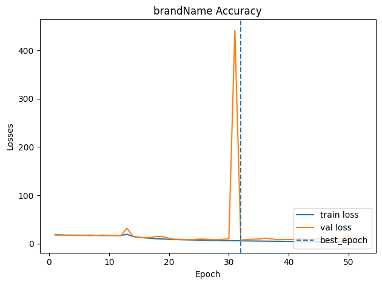
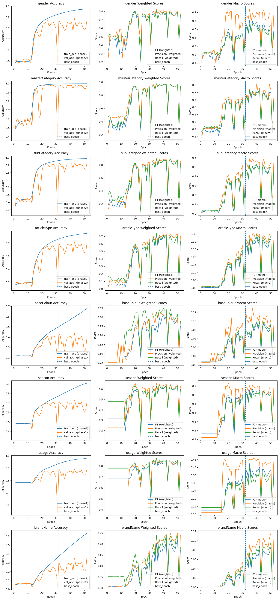

# Multi-Tag Image Classification

## Overview

This repository includes a notebook that uses fine-tuning for a multi-output image classification task. The data comes from the **Fashion Product Images** dataset on **Kaggle**; you can find the dataset at this [link](https://www.kaggle.com/datasets/paramaggarwal/fashion-product-images-dataset).  
You can also access my code for this project [here](https://www.kaggle.com/code/mbslll/multi-tag-prediction-efficientnetb0), and the trained model [here](https://www.kaggle.com/models/mbslll/efficientnetb0-for-fashion-products-image-cls/TensorFlow2/default/1).

## Data

### Dataset Orientation

When aggregated, the dataset includes 44,446 rows and 12 columns. The columns include: *id, image_path, gender, masterCategory, subCategory, articleType, baseColour, season, usage, brandName, variantName,* and *productDisplayName*.  
Among these, the last eight columns are considered the target features for our analysis.

### Exploratory Data Analysis

The figure below illustrates a severe class imbalance across most target features:

### Feature Encoding

We use **Label Encoding** for all target features due to its simplicity and memory efficiency.

## Ideal Configurations for the Model

### Pre-trained Model Used

We use **EfficientNetB0** (excluding its top layer) as the backbone of our network, followed by a multi-head output—each head being a dense layer with **softmax** activation.

### Fine-Tuning & Hyperparameters

We first train only the top layers for 25 epochs, then fine-tune the entire network (including the backbone) for an additional 50 epochs. The hyperparameters used for fine-tuning are shown below:

  <table>
    <thead>
      <tr>
        <th>Image Size</th>
        <th>Optimizer & LR</th>
        <th>Losses</th>
        <th>Training Epochs</th>
        <th>Patience for Early Stopping</th>
      </tr>
    </thead>
    <tbody>
      <tr>
        <td>(224, 224, 3)</td>
        <td>Adam, LR_phase_1 = 5e-3, LR_phase_2 = 5e-5</td>
        <td>Sparse Cross Entropy Loss</td>
        <td>epochs_phase_1 = 25, epochs_phase_2 = 50</td>
        <td>patience_phase_1 = 10, patience_phase_2 = 20</td>
      </tr>
    </tbody>
  </table>

## Evaluation

### Loss During Training

The following plot shows the training and validation loss over epochs:

### Accuracies & Scores

The plots below show the accuracy and evaluation scores during training. (Scores are computed only on the validation set.)

